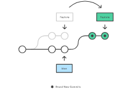

## 1. Fork in git

- A fork is a new repository that shares code and visibility settings with the original “upstream” repository.
- For example, you can use forks to propose changes related to fixing a bug. Rather than logging an issue for a bug you have found, you can:

  - Fork the repository.
  - Make the fix.
  - Submit a pull request to the project owner.

## 2. git rebase

- The git rebase command allows you to easily change a series of commits, modifying the history of your repository.
- rebase is used for integrating changes from one branch to another.



- rebasing is changing the base of your branch from one commit to another making it appear as if you'd created your branch from a different commit.

```
 git rebase --interactive <base>
```

- This rebases the current branch onto ＜ base ＞ but uses an interactive rebasing session. This opens an editor where you can enter commands for each commit to be rebased.

## 3. How to remove the commit :

- We can remove the commit by using two methods as follows.

```
git reset HEAD^
```

- This command is used to reset the current branch's HEAD to its previous commit (HEAD^ refers to the commit before the current one).

- It does not modify the working directory or the index (staging area). The changes in your files remain in the working directory,

```
git reset --hard HEAD^
```

- The --hard option is a significant difference. It not only moves the HEAD to the previous commit but also resets the staging area (index) and the working directory to match the state of the specified commit (HEAD^ in this case).

- This means that all changes in your working directory and staging area since the specified commit are discarded.
